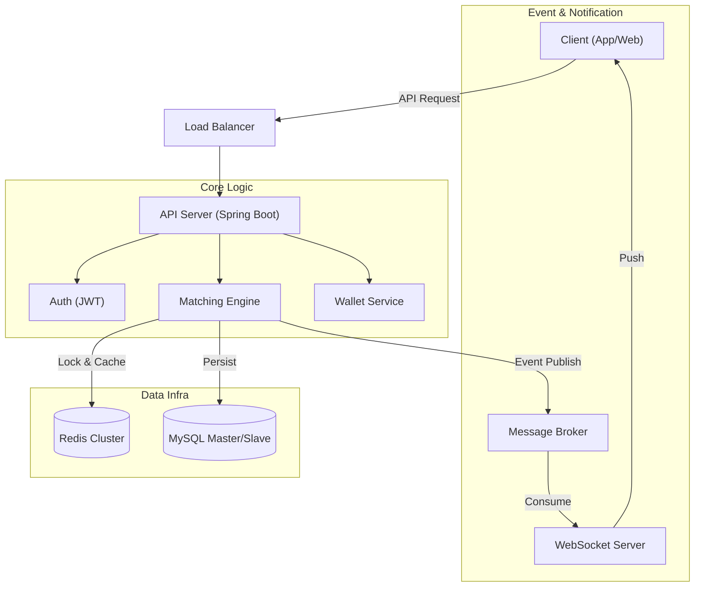

# 🏦 VAULT (볼트) - Backend

> **"검수된 실물 자산을 주식처럼 거래한다."**
>
> 동시성 제어(Concurrency Control)와 데이터 무결성(Data Integrity)을 핵심 가치로 둔 고성능 리셀 트레이딩 플랫폼입니다.

<br>

## 🛠️ Tech Stack

### Backend


### Database & Cache


### Infra & Tools


<br>

## 📖 Project Overview

**VAULT**는 기존 리셀 플랫폼의 긴 배송 시간과 정적인 거래 방식의 비효율을 개선하기 위해 설계된 **보관형 실시간 트레이딩 시스템**입니다.

사용자는 물건을 입고시킨 후 앱 내에서 **디지털 소유권**을 주식처럼 즉시 매수/매도할 수 있으며, 원할 때 언제든 실물로 출고할 수 있습니다. 본 프로젝트는 **대용량 트래픽 상황에서의 안정적인 주문 체결**과 **금융급 자산 데이터 정합성**을 보장하는 백엔드 아키텍처를 구현하는 데 주력했습니다.

### 🎯 Key Focus
*   **Concurrency:** Redis 분산 락(Distributed Lock)과 DB 비관적 락(Pessimistic Lock)을 복합 적용하여 동시성 이슈(Race Condition) 해결
*   **Matching Engine:** Redis Sorted Set을 활용한 메모리 기반 고성능 실시간 호가 매칭 로직 구현
*   **Integrity:** 자산 증발 방지를 위한 `Signature` 검증 및 이중 장부(Double Entry) 기록
*   **Scalability:** Docker Compose 기반의 컨테이너 환경 구성 및 조회 성능 최적화를 위한 캐싱 전략(Look-aside)

<br>

## 🔗 Entity Relationship Diagram (ERD)

**VAULT**의 데이터베이스 설계 구조입니다. 회원, 자산, 상품, 주문/체결, 물류 등 핵심 도메인을 정규화하여 설계했습니다.

```mermaid
erDiagram
    %% ==================================================================================
    %% [1] MEMBER DOMAIN (회원 & 인증)
    %% - Point: 소셜 로그인 확장성 반영 & 탈퇴 회원의 거래 기록 보존(논리 삭제).
    %% ==================================================================================
    USERS {
        bigint user_id PK "AUTO_INCREMENT PK"
        varchar email UK "로그인 ID (Unique). 소셜 로그인 시에는 플랫폼에서 넘겨준 이메일 저장"
        varchar password "BCrypt 암호화. 소셜 로그인 유저는 비밀번호가 없으므로 NULL 허용"
        varchar nickname UK "화면에 표시될 활동명 (Unique)"
        varchar phone_number UK "SMS/알림톡 발송 키. 본인인증 완료된 번호만 저장"
        varchar provider "LOCAL(일반), KAKAO, GOOGLE, NAVER (가입 경로 구분)"
        varchar provider_id "소셜 플랫폼의 고유 식별값(sub 등). 일반 가입은 NULL"
        varchar role "ROLE_USER, ROLE_ADMIN (검수 승인은 ADMIN 권한 필수)"
        varchar status "ACTIVE, WITHDRAWN, BANNED (탈퇴해도 정산/거래 무결성을 위해 데이터 보존)"
        datetime created_at "가입 일시"
        datetime updated_at "마지막 정보 수정 일시"
    }

    ADDRESS {
        bigint address_id PK "주소록 ID"
        bigint user_id FK "주소 소유자"
        varchar receiver_name "받는 사람 이름"
        varchar base_address "도로명 주소 (Kakao 주소 API 연동)"
        varchar detail_address "상세 주소 (동/호수)"
        varchar zip_code "우편번호 (택배사 API 연동 필수값)"
        boolean is_default "기본 배송지 여부 (User당 1개만 True 유지 로직 구현 필요)"
    }

    NOTIFICATION {
        bigint noti_id PK "알림 ID"
        bigint user_id FK "수신자 ID"
        varchar type "TRADE, PRICE, DELIV (알림 종류 구분용)"
        varchar message "사용자에게 노출될 텍스트"
        varchar related_url "클릭 시 이동할 딥링크 (예: /market/101)"
        boolean is_read "읽음 여부 (안 읽은 알림 뱃지 카운트용)"
        datetime created_at "TTL 설정 권장 (30일 지난 알림 자동 삭제)"
    }

    %% ==================================================================================
    %% [2] WALLET DOMAIN (금융 & 정산)
    %% - Point: 성능보다 '데이터 무결성(Integrity)' 최우선. 위변조 방지 장치 포함.
    %% ==================================================================================
    BANK_CODE {
        varchar bank_code PK "금융결제원 표준 은행 코드 (예: 004, 088)"
        varchar bank_name "은행명 (예: KB국민, 신한)"
        boolean is_active "점검 중이거나 제휴 종료된 은행 입금 차단용"
    }

    WALLET {
        bigint wallet_id PK "지갑 ID"
        bigint user_id FK "지갑 소유자 (User와 1:1 관계)"
        decimal balance "현재 사용 가능한 금액 (Available Balance)"
        decimal locked_balance "주문 중이거나 출금 대기 중이라 묶인 금액 (Frozen Balance)"
        bigint version "[낙관적 락] 충전/사용 동시 요청 시 덮어쓰기(Lost Update) 방지"
        varchar signature "SHA256(balance + secret_key). DB 관리자가 몰래 금액 조작 시 탐지용"
        varchar bank_code FK "입금받을 은행 코드 (BANK_CODE 참조)"
        varchar account_number "출금 시 입금받을 계좌번호"
        varchar account_holder "예금주명 (실명인증된 이름과 일치하는지 검증하여 금융 사고 방지)"
        datetime updated_at "최근 변동 시간"
    }

    WALLET_HISTORY {
        bigint history_id PK "내역 ID"
        bigint wallet_id FK "지갑 ID"
        varchar transaction_type "DEPOSIT(충전), WITHDRAW(출금), BUY, SELL, FEE"
        decimal amount "변동 금액 (+는 증가, -는 감소)"
        decimal previous_balance "[무결성 검증] 변동 전 잔액 (Prev + Amount == Current 검증용)"
        decimal balance_after "변동 후 잔액 스냅샷"
        bigint reference_id "관련된 OrderId, DeliveryId (문제 발생 시 역추적용)"
        varchar reference_type "ORDER, DELIVERY, CHARGE"
        varchar transaction_group_id UK "[멱등성/트랜잭션 그룹] 매수+수수료 처럼 N개 행을 하나의 논리적 단위로 묶는 키"
        datetime created_at "거래 발생 시간"
    }

    PLATFORM_REVENUE {
        bigint revenue_id PK "수익 내역 ID"
        varchar type "FEE_BUY, FEE_SELL, STORAGE_FEE (수익 원천 구분)"
        decimal amount "발생한 수익 금액"
        bigint related_trade_id FK "어떤 거래에서 발생한 수익인지 역추적용 (NULL 가능)"
        datetime created_at "수익 발생 일시 (일별 매출 집계 배치 시 기준값)"
    }

    DAILY_SETTLEMENT {
        varchar settlement_date PK "정산 일자 (YYYY-MM-DD)"
        decimal total_buy_amount "일일 총 매수 체결액"
        decimal total_sell_amount "일일 총 매도 체결액"
        decimal total_fee_revenue "일일 총 수수료 수익"
        decimal total_deposit "일일 총 충전액"
        decimal total_withdraw "일일 총 출금액"
        boolean is_balanced "[검증 플래그] (입/출금 차액 == 유저 잔액 총 변동분) 일치 여부 확인"
        datetime created_at "배치(Batch) 작업 완료 시간"
    }

    %% ==================================================================================
    %% [3] PRODUCT & STOCK (상품 & 재고)
    %% - Point: '실물(Vault Item)'과 '권리(Stock)'의 분리. 목록 조회 성능용 역정규화.
    %% ==================================================================================
    PRODUCT {
        bigint product_id PK "상품 ID"
        varchar code UK "관리용 코드 (예: IVE-LOVE-S)"
        varchar name "상품명"
        varchar category "KPOP, TCG, SNEAKERS (Elasticsearch 필터링 매핑)"
        varchar grade "상품 등급 (S, A, B) - 등급별로 별도 상품 취급"
        
        %% [성능 최적화] 목록 조회 시 JOIN/Aggregation 없이 즉시 노출하기 위한 필드
        bigint recent_price "[역정규화] 최근 체결가 (Update Event 발생 시 Async 동기화)"
        bigint lowest_ask_price "[역정규화] 즉시 구매가 (매도 호가 최저값). 주문 체결/변경 시 갱신"
        bigint highest_bid_price "[역정규화] 즉시 판매가 (매수 호가 최고값). 주문 체결/변경 시 갱신"
        
        varchar thumbnail_url "목록용 대표 썸네일 이미지 (가볍게 조회)"
    }

    PRODUCT_IMAGE {
        bigint image_id PK "이미지 ID"
        bigint product_id FK "대상 상품"
        varchar image_url "고화질 원본 이미지 URL"
        int display_order "상세 페이지 내 노출 순서"
        datetime created_at "등록 일시"
    }

    PRODUCT_LIKE {
        bigint like_id PK "좋아요 ID"
        bigint user_id FK "누른 사람"
        bigint product_id FK "대상 상품"
        datetime created_at "관심 상품 등록 일시 (최신순 정렬용)"
    }

    USER_STOCK {
        bigint stock_id PK "소유권 ID (User가 가진 디지털 자산)"
        bigint user_id FK "현재 소유자"
        bigint product_id FK "소유한 상품 종목"
        int quantity "판매 가능한 보유 수량 (Available)"
        int locked_quantity "매도 주문을 걸어놔서 묶인 수량 (Frozen). 주문 취소 시 원복"
        decimal average_price "평단가 (체결 트랜잭션과 분리하여 Async로 계산, Lock 경합 방지)"
        bigint version "[낙관적 락] 동시에 여러 매도 주문 시 수량 마이너스 방지"
        datetime updated_at "수량 변동 일시"
    }

    VAULT_ITEM {
        bigint item_id PK "실물 아이템 ID (창고에 있는 실제 물건)"
        bigint product_id FK "어떤 상품 종목의 실물인지"
        varchar manage_code UK "창고 관리용 QR/바코드 (Unique)"
        varchar status "IN_VAULT(보관중), INSPECTING(검수중), SHIPPING(배송중), SHIPPED(출고완료)"
        varchar location "창고 내 실제 위치 (예: Zone A-01-02)"
        bigint initial_owner_id FK "최초 입고자 ID. 주인이 바뀌어도 이 값은 불변 (CS 및 출처 추적용)"
        datetime stored_at "[FIFO 기준] 출고 요청 시 가장 오래된 물건부터 할당하기 위한 정렬 기준"
        bigint held_by_delivery_id FK "[Locking] 특정 배송 건에 할당되어 출고 대기 중인 상태 (중복 할당 방지)"
    }

    INSPECTION_LOG {
        bigint log_id PK "검수 이력 ID"
        bigint vault_item_id FK "대상 실물 아이템"
        bigint admin_id FK "검수를 진행한 관리자(USERS.role=ADMIN)"
        varchar result "PASSED(합격), REJECTED(반려)"
        varchar note "검수 특이사항 (예: 미세 스크래치 있음)"
        varchar image_url "검수 증빙 사진 URL"
        datetime inspected_at "검수 완료 시간"
    }

    %% ==================================================================================
    %% [4] TRADE & ORDER (주문 & 체결 엔진)
    %% - Point: 인덱스 설계를 통해 조회 성능 확보. 주문 데이터 파티셔닝 고려.
    %% ==================================================================================
    ORDERS {
        bigint order_id PK "주문 ID"
        bigint user_id FK "주문자"
        bigint product_id FK "대상 상품"
        varchar type "BUY(매수), SELL(매도)"
        varchar price_type "LIMIT(지정가), MARKET(시장가)"
        bigint price "희망 가격 (시장가는 0 or NULL)"
        int initial_quantity "주문 원본 수량 (취소/환불 및 통계 기준)"
        int remaining_quantity "현재 체결되지 않고 남은 수량 (0이면 체결 완료)"
        varchar status "PENDING, FILLED, PARTIAL, CANCELED, EXPIRED(만료)"
        
        datetime order_time "시간 우선 원칙(Time Priority) 정렬 기준값"
        datetime expired_at "주문 만료일. (Batch가 만료된 주문을 EXPIRED 처리하여 인덱스 깊이 제어)"
        bigint version "[비관적 락/동시성] 체결 엔진이 건드릴 때 중복 체결 방지"
        
        %% 핵심 인덱스 설계 (주석 필독)
        %% IDX_MATCH_BUY: (product_id, type='BUY', status='PENDING', price DESC, order_time ASC)
        %% IDX_MATCH_SELL: (product_id, type='SELL', status='PENDING', price ASC, order_time ASC)
    }

    TRADE {
        bigint trade_id PK "체결 ID"
        bigint product_id FK "체결된 상품"
        bigint buyer_order_id FK "매수 주문 ID"
        bigint seller_order_id FK "매도 주문 ID"
        bigint price "최종 체결 가격"
        int quantity "체결 수량"
        decimal buyer_fee "구매자가 지불한 수수료 (정산 검증용)"
        decimal seller_fee "판매자가 지불한 수수료 (정산 검증용)"
        datetime trade_time "체결 시각 (OHLC 차트 집계 기준)"
    }

    MARKET_CANDLE {
        bigint candle_id PK "차트 데이터 ID (OLAP 성격)"
        bigint product_id FK "대상 상품"
        varchar timeframe "1M(1분), 1H(1시간), 1D(일봉)"
        datetime time "캔들 시작 시간"
        bigint open "시가"
        bigint close "종가"
        bigint high "고가"
        bigint low "저가"
        bigint volume "해당 기간 누적 거래량"
    }

    %% ==================================================================================
    %% [5] LOGISTICS (배송 & 물류)
    %% - Point: 이사 등으로 유저 주소가 바뀌어도, 과거 배송 내역은 변하면 안 됨(Snapshot).
    %% ==================================================================================
    DELIVERY {
        bigint delivery_id PK "배송 ID"
        bigint user_id FK "신청자"
        varchar type "INBOUND(판매입고), OUTBOUND(구매출고)"
        varchar status "REQUESTED, SHIPPING, COMPLETED, CANCELED"
        varchar carrier_code "택배사 코드 (CJ, POST 등 추후 확장용)"
        varchar tracking_number "택배 운송장 번호"
        
        %% --- 스냅샷 필드 시작 (ADDRESS 테이블 조인 X) ---
        varchar receiver_name "수령인 이름 (신청 시점 기준 복사)"
        varchar address "전체 주소 (신청 시점 기준 복사)"
        varchar zip_code "우편번호 (신청 시점 기준 복사)"
        varchar phone_number "연락처 (신청 시점 기준 복사)"
        %% --- 스냅샷 필드 끝 ---
        
        datetime created_at "신청 일시"
    }

    DELIVERY_ITEM {
        bigint delivery_item_id PK "상세 품목 ID"
        bigint delivery_id FK "배송 ID"
        bigint vault_item_id FK "할당된 실물 ID (입고 시엔 NULL, 출고 시 필수)"
    }

    %% ==================================================================================
    %% [6] SYSTEM (시스템 안정성)
    %% - Point: 중복 요청 방지(Idempotency) 및 응답 캐싱.
    %% ==================================================================================
    IDEMPOTENCY_KEY {
        varchar key_value PK "클라이언트가 생성한 UUID (Header: Idempotency-Key)"
        varchar method "HTTP Method (POST)"
        varchar path "API Path (/api/orders)"
        text response_json "첫 번째 요청의 성공 응답값 캐싱. 재요청 시 이 값 반환"
        datetime created_at "TTL 설정을 통해 24시간 후 자동 삭제"
    }

    %% ==================================================================================
    %% Relationships (관계 정의)
    %% ==================================================================================
    USERS ||--o{ NOTIFICATION : "1:N (유저는 여러 알림을 받음)"
    USERS ||--o{ ADDRESS : "1:N (유저는 여러 주소를 가짐)"
    USERS ||--o{ WALLET : "1:1 (유저는 하나의 지갑을 가짐)"
    USERS ||--o{ USER_STOCK : "1:N (유저는 여러 종류의 디지털 자산을 보유)"
    USERS ||--o{ PRODUCT_LIKE : "1:N (관심상품)"
    USERS ||--o{ ORDERS : "1:N (주문 내역)"
    USERS ||--o{ DELIVERY : "1:N (배송 신청 내역)"

    WALLET ||--o{ WALLET_HISTORY : "1:N (지갑 변동 내역 로그)"
    BANK_CODE ||--o{ WALLET : "1:N (여러 지갑이 같은 은행을 사용 가능)"

    PRODUCT ||--o{ USER_STOCK : "1:N (상품별 소유권)"
    PRODUCT ||--o{ VAULT_ITEM : "1:N (상품에 매핑된 실물)"
    PRODUCT ||--o{ PRODUCT_IMAGE : "1:N (상품의 상세 이미지들)"
    PRODUCT ||--o{ ORDERS : "1:N (상품에 걸린 주문들)"
    PRODUCT ||--o{ TRADE : "1:N (체결 내역)"
    PRODUCT ||--o{ MARKET_CANDLE : "1:N (차트 데이터)"
    PRODUCT ||--o{ PRODUCT_LIKE : "1:N (좋아요)"

    ORDERS ||--o{ TRADE : "1:N (하나의 주문은 여러 번에 걸쳐 부분 체결될 수 있음)"
    TRADE ||--o{ PLATFORM_REVENUE : "1:N (거래 발생 시 수수료 수익 생성)"
    
    DELIVERY ||--o{ DELIVERY_ITEM : "1:N (하나의 배송에 여러 아이템 포함)"
    VAULT_ITEM |o--o| DELIVERY_ITEM : "1:1 (배송 시 실물 아이템이 매핑됨)"
    VAULT_ITEM ||--o{ INSPECTION_LOG : "1:N (하나의 아이템은 여러 번 검수될 수 있음)"
    USERS ||--o{ INSPECTION_LOG : "1:N (관리자가 수행한 검수 기록)"
```

<details>
<summary><b>ERD 상세 보기 (Mermaid)</b></summary>
<div markdown="1">



</div>
</details>

<br>

## 🏗️ System Architecture



<br>

## 📂 Directory Structure

도메인 주도 설계(DDD)를 기반으로 패키지 구성.

```text
src/main/java/com/project/vault
├── auth        # 인증/인가 (JWT, Security Filter)
├── common      # 전역 예외 처리(GlobalExHandler), 공통 Response DTO
├── member      # 회원 관리 및 프로필
├── product     # 상품 조회 및 검색
├── trade       # 주문(Order) 접수 및 체결(Match) 엔진 [Core]
├── wallet      # 자산(Point) 충전/출금 및 정산 로직
└── VaultApplication.java
```

<br>

## 📅 Features & Roadmap

### Phase 1. Foundation (진행 중)
- [ ] **환경 설정:** Docker Compose (MySQL, Redis) 구축
- [ ] **회원(Member):** JWT 기반 회원가입/로그인, Security 설정
- [ ] **자산(Wallet):** 포인트 충전/출금 및 무결성 검증

### Phase 2. Trading Engine (Core)
- [ ] **주문(Order):** 지정가 매수/매도 주문 접수 API
- [ ] **체결(Match):** Redis/DB 기반 매칭 엔진 및 트랜잭션 처리
- [ ] **동시성:** 분산 락 적용 및 멀티 스레드 테스트 작성

### Phase 3. Optimization
- [ ] **성능:** 캐싱 적용 및 쿼리 튜닝 (N+1 문제 해결)
- [ ] **실시간:** WebSocket 기반 체결 알림
- [ ] **안정성:** 부하 테스트(nGrinder) 및 모니터링

<br>

## 📚 Documentation

상세한 설계 및 트러블 슈팅 문서는 `/docs`에서 확인할 수 있습니다.

*   [**📜 기획서 & 요구사항 정의**](./docs/PROJECT_PLAN.md)
*   [**📡 API 명세서**](./docs/API_SPEC.md)
*   [**🔄 시퀀스 다이어그램**](./docs/SEQUENCE.md)

<br>

## 🚀 Getting Started

```bash
# 1. Repository Clone
git clone https://github.com/weilim0513-tech/vault-backend.git

# 2. Infra Setup
cd docker
docker-compose up -d

# 3. Build & Run
cd ..
./gradlew bootRun
```
